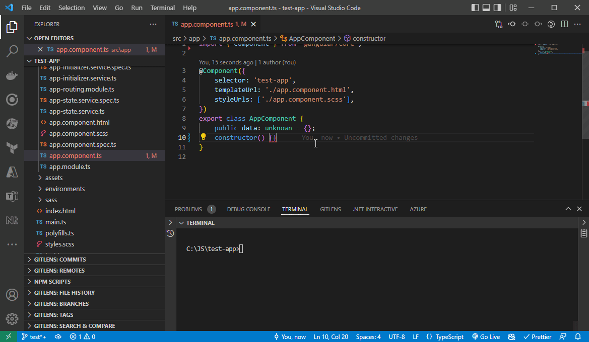
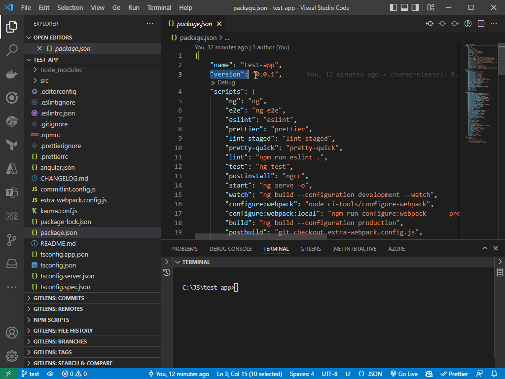

#### [Home](https://github.com/ashish-koshy/uclif/blob/main/cli/README.md)
# @uclif/cli - USAGE

## PLEASE NOTE

1. For `existing projects` : 
    1. All of the commands below would only affect `new` or `modified` files. `Un-modified` files shall remain unchanged.
    2. Please execute all commands in the directory containing your application's `package.json` file.
    3. For angular projects, the UCLIF's major versions will map 1:1 with Angular's major versions.
2. For `new projects` :
    1. Use the command `uclif new` for a comprehensive guided setup.
    2. Workspaces setup using the `uclif new` command defaults to Angular. Use `uclif new --help` for enabling or configuring more options into your workspace. 
3. Attach the flag `--help` against any command or sub command to view its description and/or help topics.
4. Attach the flag `--nonInteractive` against any command or sub command if you wish to skip all prompts or messages. This is in case you are in an automated/ci environment.
5. For pulling the latest updates for UCLIF CLI:
    1. `npm install -g @uclif/cli@latest` - Major changes + Features + Fixes
    2. Pull features or fixes for a specific major version `X`. You can find this using the command `uclif version` (this could have values like: `15`, `16` etc.):
        1. `npm install -g @uclif/cli@^X.0.0` - Features + Fixes only
        2. `npm install -g @uclif/cli@~X.0.0` - Fixes only
#
## EXISTING PROJECTS
### EASILY APPLY COMMIT CHECKS AND VALIDATIONS :

Add commit checks and validations to existing `Angular` or `TypeScript` based projects.

Command :

    uclif add:commit-checks

Effects :
1. Applies [eslint](https://eslint.org/docs/latest) rules for enhanced type checking and catching accessibility violations early on. 
2. Applies [prettier](https://prettier.io/docs/en) rules to auto format and beautify your `TypeScript`, `HTML`, `CSS`, `SCSS` etc.
3. Applies [commitlint](https://commitlint.js.org) rules to ensure a consistent format for your commit messages.



4. Adds [standard-version](https://github.com/conventional-changelog/standard-version#readme) package to help determine the `semantic version` number for your application based on your commit messages and generate `change logs`.


#
### QUICKLY ADD COMMONLY USED ANGULAR CODE THROUGH HELPER LIBRARIES :

These helper libraries provide commonly used angular `services`, `utilities` or `code schematics` that help you cut down your development time.

Command :

    uclif add:ng:helpers

Effects :
1. Adds [@uclif/ng-core](https://github.com/ashish-koshy/uclif/blob/main/angular/core) library to your project. It has the following key exports :
    1. `FormValidators` - Contains commonly used form validators for reactive forms.
    2. `StateManagerService` - A simple state management service to persist actions and their associated states in memory across multiple pages or routes.
    3. `ExternalAssetLoaderService` - A service that can be used to import external scripts or styles into your application.
2. Adds [@uclif/ng-schematics](https://github.com/ashish-koshy/uclif/blob/main/angular/schematics) library to your project that you can use to generate angular code.  
    1. A complete list of all the available code generation schemas can be found [here](https://github.com/ashish-koshy/uclif/blob/main/angular/schematics/src/collection.json).
#
### EFFORTLESSLY GENERATE AZURE BUILD PIPELINE TEMPLATES :

Generate `Node` based build pipeline templates using `YAML` with the most commonly used steps.

Command :

    uclif add:azure:template:node

Add the `--help` flag for more options. 
#
## NEW PROJECTS
### COMPREHENSIVE GUIDED SETUP :

Execute the command below to be guided through prompts and messages to setup a new project workspace :

    uclif new

<em>Execute `uclif new --help` to view all options.</em>

<em>Support for `React` framework is now available. Execute `uclif new --framework=react` to try this.</em>
#
### QUICKY CREATE A SANDBOX API SERVER :

You can easily spin up a `NodeJS` + `Express` Web server for local experimentation, sandboxing or virtualizing your external dependencies.

The illustration below has `ui-app` in the Nx workspace. The following command would generate a `NodeJS` + `Express`
web server called `server-app` and also add a proxy configuration within the `ui-app` pointing to the `server-app` :

Command :

    uclif add:node --name=server-app --frontendProject=ui-app

<em>(Execute this command in the directory containing your `Nx` workspace's `nx.json` file)</em>

SEEING A `CORS` POLICY ERROR ?

If you come across CORS policy error, install the `cors` package using the command: `npm i -D cors`

And then configure your `NodeJS + Express` application to allow CORS for your UI local host in the `main.ts` file under your server application directory. (From the e.g. above : `apps/server-app/src/main.ts`)

Place the following code before your API path definitions :
```
const cors = require('cors')

let corsOptions = { 
    origin : ['http://localhost:4200'], 
}

app.use(cors(corsOptions))
```
